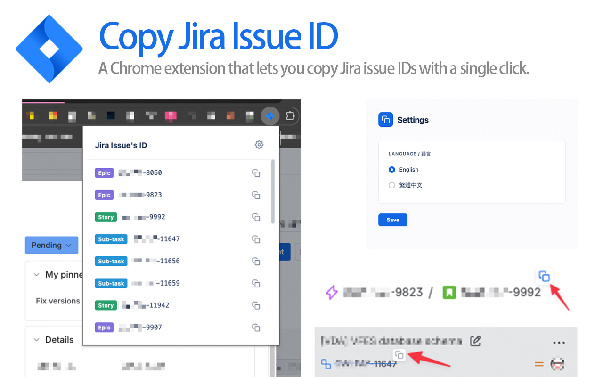
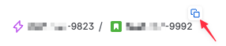
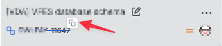
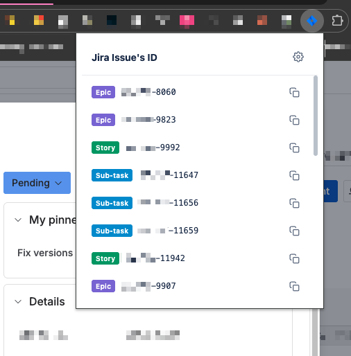
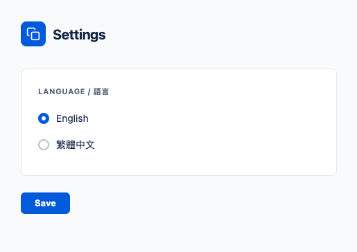

# Copy Jira Issue ID



繁體中文 | [English](../README.md)

一個 Chrome 擴充功能，讓你一鍵複製 Jira Issue ID。支援所有 `*.atlassian.net` 頁面。

## 功能

### 行內複製按鈕

將滑鼠移到頁面上任何 Jira Issue 連結時，會出現一個小型複製按鈕。點擊即可將 Issue ID 複製到剪貼簿。

**導覽列麵包屑：**



**看板卡片：**



### 彈出視窗

點擊工具列上的擴充功能圖示，即可查看目前頁面上找到的所有 Jira Issue ID。每個 ID 都會顯示其 Issue 類型（Epic、Story、Bug、Sub-task、Task 等）。點擊任一列的複製圖示即可複製該 ID。



### 設定

從設定頁面選擇你偏好的語言（English / 繁體中文）。



## 安裝

[Google Chrome 線上應用程式商店](https://chrome.google.com/webstore/detail/copy-jira-issue-id/pkhafgkgndfilihcamjpnchfclnbjknb?hl=zh-TW)

或手動安裝 — 請參考下方[開發](#開發)章節。

## 支援的網址

適用於所有 `*.atlassian.net` 頁面。可從以下網址格式偵測 Issue ID：

- `/browse/PROJECT-123`
- `/.*?selectedIssue=PROJECT-123`

## 開發

### 前置需求

- [Node.js](https://nodejs.org/)
- [pnpm](https://pnpm.io/)

### 安裝依賴

```bash
pnpm install
```

### 建置

| 指令 | 說明 |
|---|---|
| `pnpm build` | 開發建置 |
| `pnpm release` | 正式建置 |
| `pnpm publish:ext` | 互動式版本更新 + 正式建置 + 打包 zip 至 `releases/` |
| `pnpm start` | 監聽模式，自動重新建置 |
| `pnpm test` | 執行測試 |

### 在 Chrome 中載入擴充功能

1. 執行 `pnpm build`
2. 開啟 `chrome://extensions`
3. 啟用**開發人員模式**
4. 點擊**載入未封裝項目**，選擇 `dist/` 資料夾

## 技術堆疊

- **Manifest**: V3
- **建置工具**: Rollup + Babel
- **UI**: React 17（彈出視窗）
- **測試**: Jest + jest-chrome

## 授權

MIT
